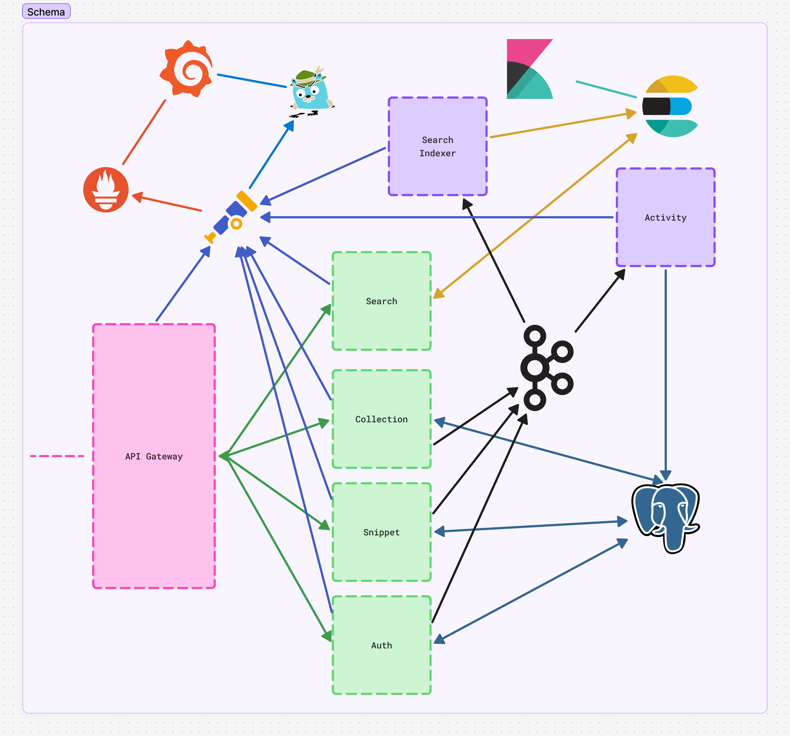

> [!IMPORTANT]
> Project was renamed from `nota` to `kakitomeru` & moved to [Kakitomeru](https://github.com/kakitomeru/kakitomeru) organization and.

# Nota (Kakitomeru)

## Overview

Monorepo for a microservices-based platform where users can create, manage, organize (into collections), tag, and search for "knowledge snippets" (code, commands, notes, links). The platform will feature robust authentication, an API gateway, event-driven updates for search indexing via Kafka, and comprehensive telemetry.

## Schema (06.15.2025)

